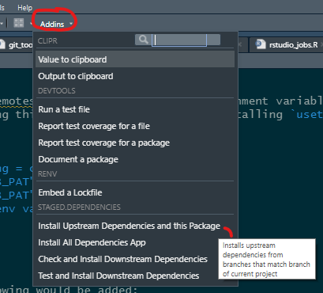

# Development Stages via git branch naming convention <a href='https://github.com/openpharma/staged.dependencies'></a  >

## Purpose

The `staged.dependencies` package simplifies the development process for developing a set of
inter-dependent R packages. In each repository of the set of R packages you are co-developing you should
specify a `staged_dependencies.yaml` file containing *upstream* (i.e. those packages your current repo depends on) and
*downstream* (i.e. those packages which depend on your current repo's package)
dependency packages within your development set of packages.

The set of packages you are co-developing are *internal* dependencies. Other R packages they depend on
are named *external* dependencies.

By using a git branching naming convention in your development work, `staged.dependencies` makes it
straightforward to:

- Install upstream dependencies (and the current package): install remote upstream dependencies
  and the local version of the current package using the requested branches for each repository.
- Check and install downstream dependencies: install downstream and their required upstream dependencies using
  the requested branches for each repository (following the branch naming convention, see below). It picks up the
  environment variable `RCMDCHECK_ARGS` and passes it as arguments to `R CMD check`.
- Test and install downstream dependencies: see above. It tests instead of checks.
- Create dependency graphs of internal dependencies.

The package also provides:

- RStudio addins to perform the above tasks with a single click.
- Install all dependencies app: A Shiny application to explore internal dependency graphs and install packages from the graph.

## Usage

### Storage directory

By deault, the directory `~/.staged.dependencies` as well as a dummy config file are created whenever the package is loaded and the directory does not exist. This is where checked out repositories are cached. To use a different location, you can set the option `staged.dependencies._storage_dir` before loading the package. Note that on Windows, the path `~/.staged.dependencies` may be a subdirectory of One Drive and this can lead to [problems](https://github.com/openpharma/staged.dependencies/issues/169).

Note staged.dependencies requires a git signature setup this can be checked with `git2r::default_signature(".")`.
If this is not setup it can be created using `git2r::config(git2r::repository("."), user.name = <<name>>, user.email = <<email>>)`
or via the git cli using, for example `git config --global user.email <email>`.

### Setup tokens

If you internal packages require [personal access tokens](https://docs.github.com/en/github/authenticating-to-github/keeping-your-account-and-data-secure/creating-a-personal-access-token) then these must be available to staged.dependencies.

There are two approaches:

1. Modify your `~/.Rprofile` file with the following:

```r
Sys.setenv("GITHUB_PAT" = "<token>") # if using https://github.com
Sys.setenv("GITLAB_PAT" = "<token>") # if using https://gitlab.com
options(
  staged.dependencies.token_mapping = c(
    "https://github.com" = "GITHUB_PAT",
    "https://gitlab.com" = "GITLAB_PAT",
    <<another_remote>> = <<token env variable>>
    ...
  )
)
```

2. Alternatively, add your token in `~/.Renviron` file,

```r
GITHUB_PAT=<token>
GITLAB_PAT=<token>
```

and add the following into your `~/.Rprofile` file:

```R
options(
  staged.dependencies.token_mapping = c(
    "https://github.com" = "GITHUB_PAT",
    "https://gitlab.com" = "GITLAB_PAT",
    <<another_remote>> = <<token env variable>>
    ...
  )
)
```

### RStudio Addins

The easiest way to use `staged.dependencies`, once installed,
is to checkout a repository and within the RStudio use the addins:



### Console

You can run the actions of the addins explicitly and change the default arguments (see function
documentation for further details)

```r
# create dependency_structure object from a checked out repo...
x <- dependency_table(project = "../stageddeps.electricity", verbose = 1)
# ... or directly from a remote
x <- dependency_table(project = "openpharma/stageddeps.electricity@https://github.com",
                      project_type = "repo@host",
                      ref = "main",
                      verbose = 1)

# print and plot it
print(x)
if (require("visNetwork")) plot(x)

#install upstream dependencies
install_deps(x, verbose = 1)

# check downstream packages
check_downstream(x, verbose = 1, check_args = c("--no-manual"))
```

Remember to restart the R session after installing packages that were already loaded.
There are additional functions (e.g. a shiny app to view the dependency graph and choose which
packages to install) in the package. See the function documentation for more details.

## Additional information

### Branch naming convention

`staged.dependencies` *knows* which branches to checkout for each of your projects due to a git
branch convention. The default branch naming convention `staged.dependencies` expects throughout your repositories
is described by the examples below:

- Given a branch name `a@b@c@d@main`, `staged.dependencies` checks for branches in each repository in the following order:
`a@b@c@d@main`, `b@c@d@main`, `c@d@main`, `d@main` and `main`.
- Suppose one implements a new feature on a branch called `feature1` that involves `repoB, repoC` with the dependency
graph `repoA --> repoB --> repoC`, where `repoA` is an additional upstream dependency. One then notices that
`feature1` requires a fix in `repoB`, so one creates a new branch `fix1@feature1@main` on `repoB`.
The setup can be summarized as follows:
```
repoA: devel
repoB: fix1@feature1@main, feature1@main, main
repoC: feature1@main, main
```
A PR on repoB `fix1@feature1@main --> feature1@main` takes
`repoA: main, repoB: fix1@feature1@main, repoC: feature1@main`.
This can be checked by setting `ref = fix1@feature1@main` and running `check_downstream` on either `repoC` or
`check_downstream` on `repoB` (which adds `repoC` to its downstream dependencies).
A PR on either `repoB` or `repoC` `feature1@main --> main` takes
`repoA: main, repoB:feature1@main, repoC: feature1@main`, setting `ref = feature1@main`.

By setting `ref = <<tag_name>>`, `staged.dependencies` will checkout each repository at the tagged commit (or by default `main`
if tag does not exist, though this can be overridden with the `fallback` argument to `dependency_table`).
The check for tag name takes priority over the branch procedure described above.

### Working with local packages

If you are working locally on a collection of packages, you can modify the `~/.staged.dependencies/config.yaml` to
automatically pick up the local packages that should be taken instead of their remote ones.
The file `~/.staged.dependencies/config.yaml` describes the available options.
For the current project, the local rather than remote version is always taken.

### Structure of `staged_dependencies.yaml` file

Given a feature and a git repository, the package determines the branch to checkout according to the branch
naming convention described above.
To get the upstream or downstream dependencies, it inspects the `staged_dependencies.yaml` file.
This file is of the form:

```yaml
---
upstream_repos:
- repo: Roche/rtables
  host: https://github.com
- repo: Roche/respectables
  host: https://github.com

downstream_repos:
- repo: example1/repo1
  host: https://github.example.com
- repo: example1/repo2
  host: https://code.example.com

current_repo:
  repo: openpharma/staged.dependencies
  host: https://github.com
```

It contains all the information that is required to fetch the repos. The `current_repo` lists the info to fetch the
project itself. All three top level fields are required although `upstream_repos` and `downstream_repos` can be empty.

Each package is cached in a directory whose name is based on `repo` and a hash of `repo, host`.
If it exists, it fetches. Otherwise, it clones.
The repositories only have remote branches, the default tracking branch is deleted. Otherwise,
there would be problems if the default branch is deleted from the remote, checked out locally, so
`git fetch --prune` would not remove it and the local branch would be among the available
branches considered in `determine_branch`.

If a repo is part of the local packages, it is not fetched, but instead copied to the cache dir. A commit is created
with all files (including staged, unstaged and untracked, but excluding git-ignored) files.
Given such a cache directory, the commit hash is added to the `DESCRIPTION` file and the package is installed, unless
the package is already installed with the same commit hash.
When calling `install_deps` and similar functions, the current project is always added to the `local_repos` so that
its local rather than remote version is installed.
For this, the `current_repo` field must be correct, so downstream dependencies do not fetch the remote version.

The `staged_dependencies.yaml` files are only used to discover upstream and downstream packages. These are called
internal packages. Then, the true dependency graph based on the `DESCRIPTION` files is constructed. All
listed upstream dependencies that are not internal are called external dependencies.
There exists a function to check that the `staged_dependencies.yaml` files are consistent: if package `x` lists
`y` as a downstream package, then `y` should list `x` as an upstream package.

When testing the addins, note that they run in a separate R process, so they pick up the currently installed version
of `staged.dependencies` rather than the one loaded with `devtools::load_all()`.

## Troubleshooting

`git2r::clone` may fail. Check that the git host is reachable (VPN may be needed) and that the access token
has read privileges for the repositories.

When you run `remotes::install_deps` for a package that was installed with this package, issues may arise because not all repositories are publicly accessible. Make sure to provide auth tokens.

Users of Macs may need to install the `oskeyring` package.

## Troubleshooting (For Developers of This Package)

For developing this package, we use `renv`. If you set environment variables such as `GITHUB_PAT` in your `~/.Rprofile`, they will
not be available because the project `.Rprofile` does not source the global `~/.Rprofile`. To enable this, put
the following into `~/.Renviron`:

```r
RENV_CONFIG_USER_PROFILE=TRUE
```

Make sure that `~/.Rprofile` does not set lib paths as this may interfere with `renv`. Also see the [renv doc](https://rstudio.github.io/renv/reference/config.html).

## Example Setup

This package can also be tested on a more complex setup of packages available at:
https://github.com/openpharma/stageddeps.elecinfra
https://github.com/openpharma/stageddeps.electricity
https://github.com/openpharma/stageddeps.food
https://github.com/openpharma/stageddeps.garden
https://github.com/openpharma/stageddeps.house
https://github.com/openpharma/stageddeps.water


You can check that the right branches of the packages are installed with:

```r
stageddeps.house::get_house()
stageddeps.water::get_water()
stageddeps.garden::get_garden()
stageddeps.food::get_food()
stageddeps.elecinfra::get_elecinfra()
stageddeps.electricity::get_electricity()
```
